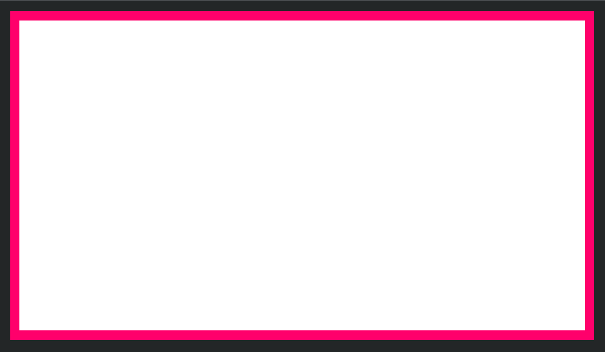
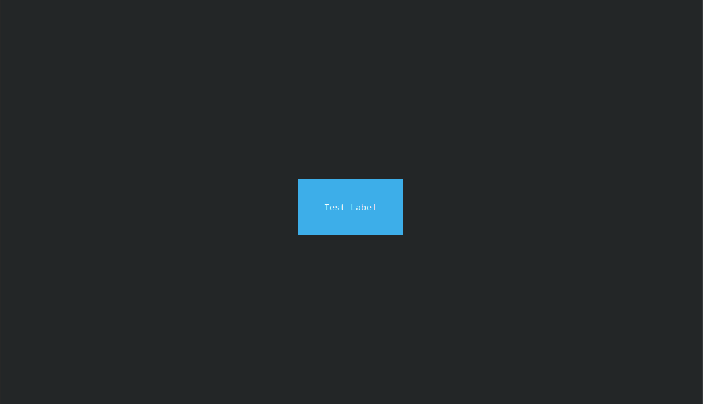

# TUI Examples

Small standalone examples for [TUI](https://github.com/Im-Beast/deno_tui)

<br>
<br>

1.  [Box in another box](Examples/Box.ts)

    ```sh
    deno task box
    ```

    <br>

    [](Examples/Box.ts)

    <br>

2.  [Dynamically centered button](Examples/Button.ts)

    ```sh
    deno task button
    ```

    <br>

    [](Examples/Button.ts)

    <br>

<br>
